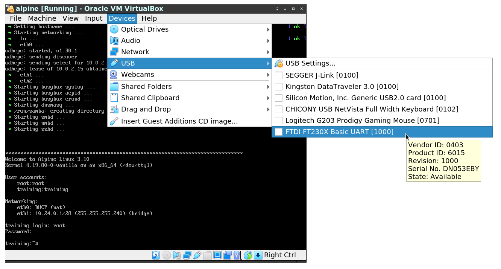

---
title: Kernel Hacking - lab guide
author: W. Ewert
date: 15-01-2020
header-includes: <script src="script.js"></script>
...


Prepare
=======

Install VirtualBox
------------------

You need up to 10 GB disk space and a 64-bit Linux or Windows 7/10 system.

Copy all the files on the USB3 HDD/USB stick being distributed, to a local directory of your choice.

Get VirtualBox (<https://www.virtualbox.org/wiki/Downloads>). Tested with VirtualBox 6.1.0.

If you are experiencing issues with starting the VM on Linux, make sure you have the all the kernel modules loaded on the host:

```
$ lsmod  | grep vbox
vboxpci                23077  0 
vboxnetadp             25443  0 
vboxnetflt             27598  2 
vboxdrv               344446  5 vboxnetadp,vboxnetflt,vboxpci
```

Most distributions manage modules through dkms, so you need to install the `-dkms` package.

Create the virtual machine
--------------------------

Unzip the disk image (*kernel_hacking/vm/alpine.vdi.zip*)

Click *New* on the toolbar, and follow the machine creation wizard.

Select Type: *Linux*, Version: *Linux 2.6/3.x/4.x (64-bit)*. <br>
Click *Next*

Optionally: add more RAM.<br>
Click *Next*

Select *Use an existing virtual hard disk file*<br>
Click *Add*, select the disk image you extracted (*alpine.vdi*)<br>
Click *Create*

Set up networking
-----------------

First, create a new Host-only Network.

Open *File* → *Host Network Manager... (`Ctrl`+`H`)*<br>
Click *Create*<br>
Use the following IP configuration:

- IPv4 Address: **10.24.1.2**
- IPv4 Network Mask: **255.255.255.240**


Click *Apply*, then *Close*

Open the *Settings* dialog for the virtual machine you have created.<br>
Select the *Network* page.

Set up the virtual machine network adapters as shown below:

- *Adapter 1*: Attached to: **NAT**
- *Adapter 2*: Attached to: **Bridged Adapter**<br>
	Select the physical Ethernet controller from the drop-down list.<br>
	It will be used to network boot the target<br>
	Windows: usually, the wired adapter is called *Local Area Connection*<br>
	Linux: *eth0*, *eno1*, *en?p?*
- *Adapter 3*: Attached to: **Host-only Adapter**<br>
	This adapter connects to the host-only network.<br>
	It will be used to access the VM from the host.

The virtual machine will serve files to the target board via 10.24.0.1/28 (eth1). The other adapter, 10.24.1.1/28 (eth2) is used to access the VM via SSH and edit files via SSHFS and Samba.

*For your reference.* IP configuration:

```
10.0.2.xx/24 - VM NAT for Internet access (Adapter 1, eth0)
10.24.0.1/28 - VM bridged Ethernet (Adapter 2, eth1)
10.24.0.8/28 - target board
10.24.1.1/28 - VM in the host-only network (Adapter 3, eth2)
10.24.1.2/28 - laptop in the host-only network
```

Start the virtual machine
-------------------------

Click *Start* on the toolbar. Wait for the VM to boot up.

You should now be able to access the VM via SSH: 

+ Linux: `ssh training@10.24.1.1`

+ Windows: use PuTTY


Use the following credentials to log in:
```
username: training
password: training
```

Connecting over ssh is recommended, as we are going to run multiple sessions on the target at the same time: debugger session, target console, and serial console multiplexer.

File access
-----------

In **Linux**, you can use either a Samba network share, or sshfs.

- samba <br>
```
sudo mount.cifs -o guest,uid=$(id -u),gid=$(id -g) //10.24.1.1/training /mnt/
```
The `uid=` and `gid=` options set the ownership of the mounted files and directories, so you do not need to be root for write access.

- sshfs<br>
```
mkdir ~/sshfs
sshfs training@10.24.1.1:/home/training/ ~/sshfs
```

<!--- On **Windows**, you can access the VM's home directory by opening a network share in Explorer: --->

On **Windows 7**, you can browse the SMB share in Explorer:

 

On **Windows 10** (and **Windows 7**), you can access the filesystem using WinSCP:

```
File protocol: SFTP
Host name: 10.24.1.1
Port number: 22
User name: training
Password: training
```


Deploy
======

Flash the SD card
-----------------

Flash *sdcard.img* onto the MicroSD card. You may use either the built-in SD card reader in your laptop, or a USB card reader. 

**Linux:**

After you insert the card, identify the right device node:

```
lsblk -o NAME,MODEL
```

A built-in card reader will most likely be called `/dev/mmcblk0`, and the card's partitions `/dev/mmcblk0p1`, `/dev/mmcblk0p2` and so on.

Built-in:

```
NAME        MODEL
sda         GOODRAM
├─sda1
└─sda2
mmcblk0                       
└─mmcblk0p1
```

USB card readers are given names in the same format as SATA devices `/dev/sdX`, so **be careful not to overwrite your system drive!**

USB:

```
NAME        MODEL
sda         GOODRAM
├─sda1
└─sda2
sdb         USB  SD Reader
└─sdb1
```


Write the image with `dd`:

```
dd if=sdcard.img of=/dev/mmcblk0 bs=1M
```

or

```
dd if=sdcard.img of=/dev/sd? bs=1M
```

```
64+0 records in
64+0 records out
67108864 bytes (67 MB, 64 MiB) copied, 4.97096 s, 13.5 MB/s
```

**Windows:**

Extract and run *Win32DiskImager*. Select the image file, the card reader device, and then click *Write*:

 

Boot the target
---------------

Insert the MicroSD card into the slot on the module, and connect to the Micro-USB port:


The Micro-USB port in the corner of the board is connected to a serial port with an FTDI converter chip, it also supplies power to the target.


Access the target serial console
--------------------------------

**Method 1: (Linux)** 

Add yourself to the dialout group:

```
sudo usermod -a -G dialout $USER
```

Log out, log back in (or reboot) to reload group memberships, and add the serial port to the VM in the settings dialog:


In the VM, connect to the serial port:

```
sudo picocom -b 115200 /dev/ttyS0

```

You should be able to see a login prompt after pressing `Return ↵`. You can log in as `root` without a password. Press `CTRL`+`A`, `CTRL`+`X` to close the serial port.

**Method 2: ** USB forwarding

Attach the USB-serial converter to the VM: on the menu bar, click *Devices* → *USB* → *FTDI FT230X Basic UART*




Open the serial port on the VM: 

```
training:~$ sudo picocom -b 115200 /dev/ttyUSB0
```

You should be able to see a login prompt after pressing `Return ↵`. You can log in as `root` without a password. Press `CTRL`+`A`, `CTRL`+`X` to close the serial port.

Network boot<!-- -- OPTIONAL -- REMOVED -->
------------

<!--
**The SD card image for this session already contains a kernel with the example driver compiled in and all necessary debug options enabled, as described in the following points. Just skip to Chapter 3.**
-->

When working on driver development, it saves a lot of time to be able to automate running new versions of the Linux kernel image. One way is to use tftp boot over the Ethernet interface.

With the serial console session open, press the red *Reset* button on the board. You should see the bootloader initialize and wait for a few seconds:

```
U-Boot 2017.03-dirty (Dec 26 2019 - 13:30:37 +0100)

CPU:   Freescale i.MX6ULL rev1.1 696 MHz (running at 396 MHz)
CPU:   Industrial temperature grade (-40C to 105C) at 32C
Reset cause: POR
Model: SoMLabs VisionSOM-6ULL
Board: SomLabs VisionSOM 6ULL
DRAM:  512 MiB
MMC:   FSL_SDHC: 0
In:    serial
Out:   serial
Err:   serial
switch to partitions #0, OK
mmc0 is current device
Net:   FEC0 [PRIME]
Warning: FEC0 (eth0) using random MAC address - 12:b4:cc:76:6c:d3

Normal Boot
Hit any key to stop autoboot:  3 
```

Hit any key and enter the serial console.

```
=>
```

u-boot, the bootloader, stores the boot configuration in environment variables.

* `printenv` shows the current environment
* `setenv` sets new values to variables
* `saveenv` writes the environment to the MicroSD card

Use the following commands in the u-boot console to make it boot from the tftp server in the VM:

```
setenv ipaddr 10.24.0.8
setenv serverip 10.24.0.1
setenv bootargs root=/dev/mmcblk1p1 rootwait rw
setenv bootcmd 'tftpboot $loadaddr $image; tftpboot $fdt_addr $fdt_file; bootz $loadaddr - $fdt_addr'
saveenv
```

The `bootcmd` variable is run after the countdown ends. `tftpboot` downloads a file from tftp to memory, and `bootz` boots the zImage-format kernel from memory, with an optional initrd (`-`) and devicetree. `bootargs` are passed as the kernel command line.

Make sure the Ethernet cable runs between your laptop and the target board, and press *Reset*.

Example device driver
---------------------

This part will be presented live.

Files affected:

```
arch/arm/boot/dts/somlabs-visionsom-6ull.dts
drivers/misc/hello.c
drivers/misc/Kconfig
drivers/misc/Makefile
```

You can view the changes using `git diff <filename>`.


Prepare build environment
-------------------------

The target board is a different architecture (arm) than the virtual machine and the host (x86_64), so the kernel must be cross-compiled with a special toolchain.

A cross-compiling toolchain has been generated by Yocto and installed in `/opt/meta-toolchain-4.14-sumo`. To use it, source the configuration script:

```
source /opt/meta-toolchain-4.14-sumo/environment-setup-cortexa7hf-neon-poky-linux-gnueabi
```

From now on, within this session, you can use the *arm-poky-linux-gnueabi-* toolchain. The kernel build system will automatically detect that it is cross-compiling by checking the `ARCH` environment variable.

```
training:~$ echo $ARCH
arm
```

Configure and rebuild the kernel
--------------------------------

First, load the default configuration for 32-bit i.MX processors:

```
cd ~/linux-imx
make imx_v7_defconfig
```

Select additional configuration options using an ncurses-based interface:

```
make menuconfig
```

How to use `menuconfig`:

* `Return ↵` enters a sub-menu `-->`

* `<ESC>` `<ESC>` goes up one level

* SPACE toggles the selected option:
	* `<*>` or `[*]` - enabled, and compiled in
	* `< >` or `[ ]` - disabled
	* `<M>` - enabled, and built as a kernel module
	* `?` - view help for the selected config
	* `/` - search


Enable the following configuration options:

```
Device Drivers ---> Misc devices  ---> <*> Hello Example Driver (CONFIG_HELLO)
Kernel hacking ---> Compile-time checks and compiler options ---> [*] Compile the kernel with debug info (CONFIG_DEBUG_INFO)
Kernel hacking ---> [*] KGDB: kernel debugger ---> [*] KGDB: use kgdb over the serial console
Kernel hacking ---> [*] Tracers ---> [*] Kernel Function Tracer (CONFIG_FUNCTION_TRACER)
Kernel hacking ---> [*] Tracers ---> [*] Kernel Function Graph Tracer (CONFIG_FUNCTION_GRAPH_TRACER)
```

Exit from the top-level menu and save the new config. Then, build the kernel and device tree:

```
make zImage
make somlabs-visionsom-6ull.dtb
```

If you assigned a higher number of virtual CPU cores to the VM (e.g. 4), you can speed up the build by adding ` -j 4`. A single core build should take approx. **15-20 minutes**.

Boot with the new kernel
------------------------

Now, after you reset the target, it will boot the kernel and devicetree over the network, and the *hello* driver will control the four LEDs. Check if this still works after a kernel panic:

```
echo c > /proc/sysrq-trigger
``` 

Hack
====

Debugging
---------

In the u-boot shell, add new arguments to the kernel commandline. `kgdbwait` waits for a debugger to be attached, `kgdboc` stands for *KGDB Over Console*.

```
setenv bootargs root=/dev/mmcblk1p1 rootwait rw kgdbwait kgdboc=ttymxc0,115200
```

Close `picocom` to free the serial port (`CTRL`+`A`, then `CTRL`+`X`).

Open three ssh sessions to the VM.

Session 1: debug splitter

```
cd ~/agent-proxy/
sudo ./agent-proxy 4440^4441 0 /dev/ttyUSB0,115200
```

Session 2: console

```
telnet 127.0.0.1 4440
```

Session 3: gdb

```
source /opt/meta-toolchain-4.14-sumo/environment-setup-cortexa7hf-neon-poky-linux-gnueabi
cd ~/linux-imx
arm-poky-linux-gnueabi-gdb vmlinux -ex "target remote 127.0.0.1:4441"
```

Minimalistic GDB cheatsheet - from the excellent [GDB cheat sheet](https://gist.github.com/rkubik/b96c23bd8ed58333de37f2b8cd052c30):

```
Breakpoints
(gdb) break hello_probe    set a breakpoint on a function
(gdb) break basic.c:101    set breakpoint at file and line (or function)
(gdb) info breakpoints     show breakpoints
(gdb) delete 1             delete a breakpoint by number

Running
(gdb) cont          continue the program
(gdb) step          single step the program; step into functions
(gdb) next          step but step over functions 
(gdb) finish        finish current function's execution
(gdb) CTRL-C        actually SIGINT, stop execution of current program 

Stack backtrace
(gdb) bt        	print stack backtrace
(gdb) frame        	show current execution position
```

Tracing
-------

Use trace-cmd to trace function calls in the kernel:

```
trace-cmd stream -p function -l "hello_*"
```

Alternatively, use the sysfs interface to ftrace:

```
cd /sys/kernel/debug/tracing/
echo "hello_*" > set_ftrace_filter
echo "gpiod_*" >> set_ftrace_filter
echo function-graph > current_tracer
echo 1 > tracing_on
cat trace_pipe
^C

# clean the trace buffer
echo > trace

# check trace filter
cat set_ftrace_filter
```


________________________________________________________________________________
rev. 1.1a
<br>
<br>
<br>
<br>
<br>
<br>
